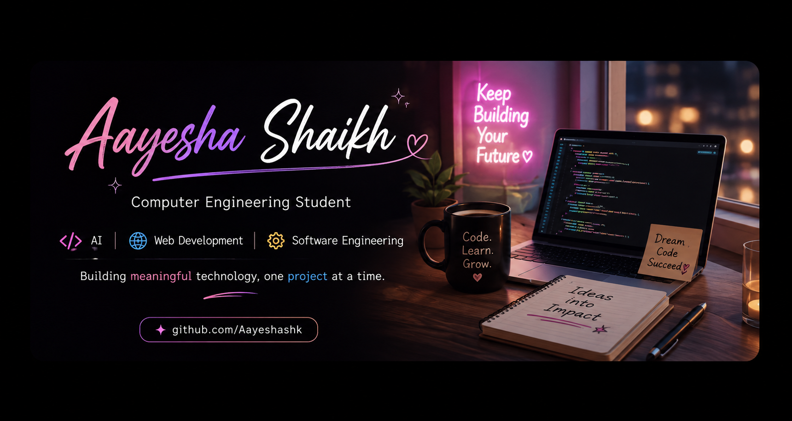

<!-- ================================================= -->
<!--             AAYESHA SHAIKH PROFILE                -->
<!--        FUTURISTIC • NEON • DARK • DYNAMIC          -->
<!-- ================================================= -->

  

  

 

---

# ✦ HELLO WORLD ✦

 

<table>

<tr>

<td width="55%" valign="top">

## 👩‍💻 Hi, I'm Aayesha!

I'm a **Computer Engineering student** passionate about building meaningful technology and turning ideas into real projects.

I enjoy exploring the intersection of:

🧠 **Artificial Intelligence & Machine Learning**

💻 **Software Development**

🌐 **Web Development**

🎨 **UI/UX & Digital Experiences**

🚀 **Intelligent Systems**

 

I believe the best way to learn technology is:

### ⚡ Build. Break. Learn. Improve. Repeat.

 

My goal is to continuously improve my technical skills while creating projects that solve real-world problems.

 

</td>

<td width="45%" align="center">

</td>

</tr>

</table>

  

---

# 🚀 CURRENTLY EXPLORING

<table>

<tr>

<td width="33%" align="center">

### 🧠 AI & ML

Exploring intelligent systems, machine learning concepts and AI-powered applications.

</td>

<td width="33%" align="center">

### 💻 DEVELOPMENT

Building projects using modern programming languages, web technologies and developer tools.

</td>

<td width="33%" align="center">

### 🧩 PROBLEM SOLVING

Improving programming skills, logical thinking and real-world problem solving.

</td>

</tr>

</table>

  

---

# 💫 MY DIGITAL TOOLKIT

### Technologies I'm learning, building and experimenting with

 

  

  

---

# 🐍 CONTRIBUTION SNAKE

<h2 align="center">🐍 CONTRIBUTION SNAKE</h2>

  <i>Watch my contributions come alive 🐍✨</i>

 

  

 

---

# 🚀 FEATURED PROJECTS

### Things I've been building and exploring

 

<table>

<tr>

<td width="50%" valign="top">

## 🌐 Web Development

### Interactive Web Projects

Projects focused on creating responsive, interactive and user-friendly web applications.

 

**✨ Exploring**

- Responsive Web Design
- Frontend Development
- Backend Integration
- APIs
- Modern UI/UX

 

</td>

<td width="50%" valign="top">

## 🧠 AI & Intelligent Systems

### Building Smarter Technology

Projects exploring artificial intelligence, machine learning and intelligent applications.

 

**✨ Exploring**

- Machine Learning
- Artificial Intelligence
- Intelligent Systems
- Automation
- Data-driven Solutions

 

</td>

</tr>

<tr>

<td width="50%" valign="top">

## 💻 Software Projects

### Solving Practical Problems

Applications designed to solve problems using programming and modern software technologies.

 

**✨ Exploring**

- Software Engineering
- Problem Solving
- System Design
- Clean Code
- Project Development

 

</td>

<td width="50%" valign="top">

## 🎨 Digital Experiences

### Technology Meets Creativity

Exploring the combination of development, design and interactive experiences.

 

**✨ Exploring**

- UI/UX Design
- Interactive Interfaces
- Modern Aesthetics
- User Experience
- Creative Technology

 

</td>

</tr>

</table>

  

---

# 🛸 CURRENT MISSION

  

---

# 🌐 LET'S CONNECT

### Always open to learning, collaboration and interesting ideas.

 

  

  

## ✨ Thanks for visiting my little corner of the internet ✨

### Building meaningful technology, exploring new ideas and turning curiosity into code.

 

